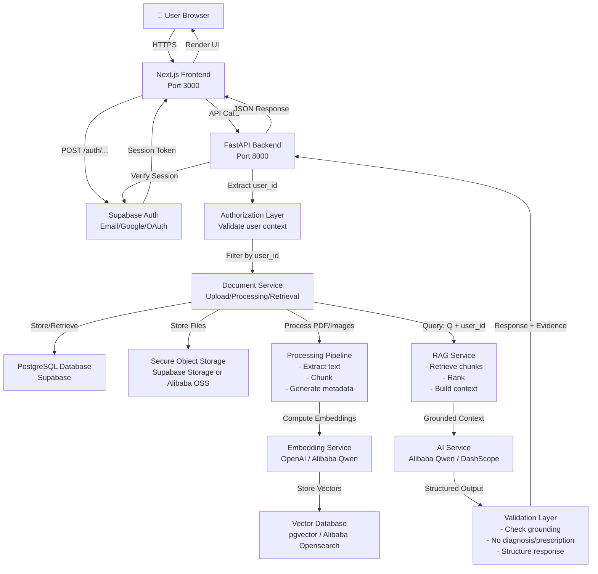

# MediCare AI — Target Architecture

**Version**: 1.0  
**Date**: 2026-08-27  
**Project**: Alibaba Cloud AI Hackathon Pakistan 2026  

---

## 1. Architecture Principles

1. **Security before convenience** — User isolation enforced at database level, not application level.
2. **Evidence before AI generation** — Retrieval executes before LLM call; LLM receives only bounded, user-owned context.
3. **Real data before demo data** — No synthetic/fake medical data in production responses; errors return honest status, not plausible fiction.
4. **Deterministic logic where possible** — Text extraction, chunking, field extraction use deterministic algorithms, not LLM interpretation.
5. **AI only where reasoning/generation adds value** — Use AI for question answering; use deterministic logic for document processing, chunking, comparison.
6. **User data isolation at backend/database level** — Every query filtered by user_id; user_id extracted from Supabase session, never trusted from client.
7. **Graceful failure instead of fake fallback responses** — API returns structured error, not cached demo data or hallucinated medical information.
8. **Minimum necessary infrastructure** — Avoid microservices, message queues, and third-party services unless they solve a concrete problem.
9. **Alibaba Cloud services must provide genuine technical value** — Only use Alibaba services where they replace a significantly more expensive or complex local alternative.

---

## 2. Target System Architecture

### System Diagram



### Data Flow: Document Upload

```
User selects file
    ↓
Frontend POST /api/documents/upload
    ↓
Backend verifies Supabase session → extract user_id
    ↓
Validate file (size, MIME type, magic bytes)
    ↓
Store original file to Supabase Storage (encrypted, user_id path)
    ↓
Extract text using PDF library + OCR
    ↓
Store document record in PostgreSQL (user_id, filename, status=extracting)
    ↓
Extract metadata (date, type, provider)
    ↓
Chunk text semantically (medical section boundaries)
    ↓
Generate embeddings for each chunk using embedding service
    ↓
Store chunks + embeddings in PostgreSQL + vector DB
    ↓
Update document status=ready
    ↓
Return success to frontend
```

### Data Flow: Question → Answer

```
User submits question
    ↓
Frontend POST /api/medical-answer (authenticated)
    ↓
Backend verifies session → extract user_id
    ↓
Validate question (length, content)
    ↓
Generate embedding for question using same embedding service
    ↓
Query vector DB: find chunks with cosine similarity > threshold
    ↓
Filter results: keep only chunks from documents owned by user_id
    ↓
Rank results by relevance score
    ↓
Construct bounded context (top 5 chunks, max 2000 tokens)
    ↓
Send to AI: grounded context + system instructions + question
    ↓
AI generates answer grounded in context
    ↓
Validation layer:
  - Check answer references evidence
  - Block diagnosis/prescription
  - Structure output (answer, confidence, evidence)
    ↓
Return response + evidence references to frontend
    ↓
Frontend displays answer + shows evidence snippets
```

---

## 3. Technology Responsibilities

### Frontend (Next.js + React + TypeScript)

**Responsibility**: User interaction, form handling, data display, session management, API communication.

**Specific tasks**:
- Authentication UI (login/signup forms)
- Dashboard layout and navigation
- Document upload form
- Timeline visualization
- Q&A interface
-**Medical Safety Checks** (deterministic, regex-based):
- Evidence display
- Error state display
### Supabase Auth

- Email/password registration
- Email/password login
- Password reset
- JWT token refresh

**Why**: Managed auth service reduces security burden, handles OAuth complexity, provides REST API for backend validation.

### PostgreSQL Database (via Supabase)

**Responsibility**: Persistent storage of user data, documents, chunks, embeddings, and audit logs.

**Specific tables**:
- `users` (Supabase-managed auth)
- `documents` (document metadata, ownership, processing status)
- `document_chunks` (text chunks, metadata, embedding vectors)
- `audit_logs` (user actions for compliance/debugging)

**Why**: Relational structure suitable for user-document relationships, pgvector extension supports embeddings, Supabase provides managed hosting and row-level security (RLS).

### FastAPI Backend (Python)

**Responsibility**: API endpoints, business logic, orchestration, security enforcement.

**Specific tasks**:
- HTTP endpoints for upload, processing, Q&A, comparison
- Authentication/authorization enforcement
- Document processing orchestration
- RAG pipeline execution
- AI provider integration
- Response validation
- Error handling

**Why**: Async request handling suitable for I/O-bound operations (network calls, file I/O), Pydantic for automatic request validation and OpenAPI documentation, Python ecosystem rich in ML/NLP libraries.

### Document Processing Pipeline

**Responsibility**: Convert raw files into structured, indexed documents.

**Components**:
- **PDF extraction**: PyPDF2 or pdfplumber to extract text preserving structure
- **OCR**: Tesseract for image documents
- **Text cleaning**: Normalize whitespace, handle encoding errors
- **Metadata extraction**: Parse dates, detect document type
- **Chunking**: Semantic chunking using medical section boundaries (Assessment, Plan, Medications, etc.)
- **Error handling**: Log failures, don't synthesize fallback data

**Why**: Deterministic processing ensures reproducibility; real extraction ensures data integrity.

### Embedding Service (OpenAI or Alibaba Qwen)

**Responsibility**: Convert text into vector embeddings for semantic search.

**Specific tasks**:
- Embed question before retrieval
- Embed each document chunk
- Store embeddings in vector database
- Consistency across all chunks (same model version)

**Why**: Semantic search requires embeddings; outsourcing to managed service reduces infrastructure.

### Vector Database (pgvector in PostgreSQL or Alibaba Opensearch)

**Responsibility**: Efficient similarity search over document embeddings.

**Specific tasks**:
- Store chunk embeddings
- Index for fast similarity search
- Return top-K similar chunks for query
- Filter by user_id during search

**Why**: Enables semantic retrieval; pgvector integrated with PostgreSQL; Opensearch as alternative if scale requires it.

### AI/LLM Provider (Alibaba Qwen / DashScope)

**Responsibility**: Generate grounded answers to medical questions.

**Specific tasks**:
- Receive bounded context (retrieved chunks only)
- Receive system instructions (no diagnosis, cite evidence, etc.)
- Generate structured response
- Return confidence level and evidence references

**Why**: Medical reasoning requires LLM; Alibaba/Qwen chosen for hackathon alignment and cost efficiency in Asia.

### Validation Layer

**Responsibility**: Ensure AI output is safe and grounded before returning to user.

**Specific tasks**:
- Verify answer references provided evidence
- Block diagnosis/prescription keywords
- Check confidence level is justified
- Ensure output format is valid
- Log all answers for quality review

**Why**: Safety layer isolates medical claims checking from AI generation; deterministic rules prevent hallucinations.

### Supabase Storage / Alibaba OSS

**Responsibility**: Secure file storage for uploaded documents.

**Specific tasks**:
- Store original PDF/image file
- Encrypt at rest
- Path-based access control (user_id in path)
- Serve file for user download/inspection

**Why**: Managed storage with encryption; Alibaba OSS alternative if scale requires China-region hosting.

---

## 4. Frontend Architecture

### Route Structure

```
/
  ├─ /login          (unauthenticated)
  ├─ /auth/callback  (OAuth callback)
  └─ /dashboard      (authenticated)
       ├─ /dashboard  (main page with all sections)
```

### Authentication Boundary

- Middleware in `lib/supabase/proxy.ts` validates Supabase session on every request to `/dashboard`
- Unauthenticated users redirected to `/login`
- Session token stored in cookies (secure, httpOnly, sameSite)

### Dashboard Layout

**Sections**:
- **Header**: User email, sign-out button, app branding
- **Document Upload**: Drag-drop or file picker, progress indicator
- **Document List**: Uploaded documents with status, upload date, delete action
- **Medical Timeline**: Chronological events extracted from documents
- **Q&A Panel**: Text input for question, answer display with evidence, history
- **Comparison**: Select two documents, view differences
- **Error Display**: Toast/alert for API errors and failures

### Component Structure

```
app/
├─ layout.tsx              (root layout, metadata)
├─ page.tsx                (redirect to /login)
├─ login/page.tsx          (auth UI)
├─ auth/callback/route.ts  (OAuth callback)
└─ dashboard/
   ├─ page.tsx             (main dashboard)
   ├─ hooks/               (useAuthentication, useDocuments, etc.)
   └─ components/
       ├─ DocumentUpload.tsx
       ├─ DocumentList.tsx
       ├─ Timeline.tsx
       ├─ QAPanel.tsx
       ├─ Comparison.tsx
       └─ ErrorDisplay.tsx
```

### API Client

`lib/api.ts`:
- `uploadDocument(file)` → POST /api/documents/upload
- `processDocument(documentId)` → POST /api/documents/process
- `askQuestion(question, documentIds)` → POST /api/medical-answer
- `compareDocuments(leftId, rightId)` → POST /api/compare-reports
- `getDocuments()` → GET /api/documents (new endpoint needed)

All functions include error handling: return structured error if API fails, not fallback data.

### Data Flow

- Global state: Authenticated user (from Supabase)
- Document list state: Fetched from backend, filtered by backend for user
- Q&A state: Questions and answers displayed with evidence
- Loading states: Show spinner during API calls, disable buttons during requests
- Error states: Display error message, suggest action (retry, upload document, etc.)

### No Demo Data in Target

- `initialDocuments` array removed → documents fetched from backend
- `starterAnswers` array removed → answers from API only
- `initialComparisonRows` removed → comparison computed from real documents
- Frontend fallback functions (`generateMedicalAnswer`, `compareMedicalReports`) still exist but only used if API fails (error state)

---

## 5. Backend Architecture

### Layered Design

```
HTTP Layer (FastAPI routes in main.py)
    ↓
Authentication Layer (verify session, extract user_id)
    ↓
Authorization Layer (enforce user_id ownership)
    ↓
Business Logic Layer (services)
    ├─ DocumentService (upload, list, delete)
    ├─ ProcessingService (extract, chunk, embed)
    ├─ RAGService (retrieve, rank, context build)
    ├─ ValidationService (safety checks)
    └─ AIService (call LLM provider)
    ↓
Persistence Layer (database, storage)
```

### API Endpoints

**Target endpoints** (see section 14 for full detail):

- `GET /api/health` — System status
- `POST /api/documents/upload` — Upload + initial store
- `POST /api/documents/process` — Extract + chunk + embed
- `GET /api/documents` — List user's documents (NEW)
- `DELETE /api/documents/{id}` — Delete document (NEW)
- `POST /api/medical-answer` — Retrieve + AI answer
- `POST /api/compare-reports` — Compare two reports
- `GET /api/documents/{id}` — Get document details (NEW, with ownership check)

### Service Modules

**`document_service.py`** (NEW):
- `upload_document(file, user_id)` → validate, store file, create record
- `list_documents(user_id)` → return documents owned by user
- `get_document(document_id, user_id)` → return document with ownership check
- `delete_document(document_id, user_id)` → delete with ownership check

**`processing_service.py`** (REFACTOR):
- `extract_text_from_file(file_path)` → real PDF extraction, not synthetic
- `extract_metadata(file)` → parse date, detect type, preserve original info
- `chunk_text(text)` → semantic chunking, not word-boundary chunking
- `generate_embeddings(chunks)` → call embedding service
- `store_chunks(document_id, chunks, embeddings, user_id)` → persist to DB

**`rag_service.py`** (NEW):
- `retrieve_chunks(question_embedding, user_id, top_k=5)` → query vector DB, filter by user_id
- `rank_chunks(question, chunks)` → score by relevance
- `build_context(chunks)` → format as prompt input
- `validate_context_grounding(answer, chunks)` → check answer references evidence

**`ai_service.py`** (REFACTOR):
- `generate_answer(context, question, user_id)` → call Alibaba/Qwen LLM
- `parse_structured_output(response)` → extract answer, confidence, evidence
- `validate_safety(answer)` → block diagnosis/prescription

**`validation_service.py`** (NEW):
- `check_grounding(answer, evidence)` → verify claims supported by evidence
- `check_medical_safety(answer)` → regex/keyword block for diagnosis/prescription
- `structure_response(answer, confidence, evidence)` → format for API
- `log_interaction(question, answer, user_id)` → audit trail without exposing medical content

### Error Handling

Every endpoint catches exceptions and returns structured error responses with appropriate HTTP status codes (401, 403, 404, 500, 503, 504) and JSON error messages. No stack traces or sensitive details exposed to client.

---

## 6. Authentication & Authorization

### Current State

✅ **Authentication**: Supabase Auth working
- Email/password signup/login implemented
- Google OAuth configured
- Session tokens validated in frontend

❌ **Backend authentication**: Not implemented
- Backend never validates Supabase session
- Backend never extracts user_id
- No JWT verification in FastAPI

❌ **Authorization**: Not implemented
- No ownership checks on documents
- All documents globally accessible
- No user isolation

### Target State

**Authentication Flow**:

1. User logs in at `/login` → Supabase Auth returns session token
2. Session token stored in secure cookie
3. Frontend proxy middleware (`lib/supabase/proxy.ts`) validates token
4. Frontend passes token to backend in Authorization header: `Authorization: Bearer {token}`
5. Backend (NEW) verifies token signature with Supabase public key
6. Backend extracts `user_id` from token claims
7. Backend passes `user_id` through all subsequent operations

**Authorization Implementation**:

Every document operation must:
- Extract user_id from authenticated session token
- Verify document ownership before proceeding
- Return 403 Forbidden if user does not own resource
- Never return data from documents owned by other users

---

## 7. Data Architecture

### Database Schema (PostgreSQL via Supabase)

**Table: `users`** (Supabase-managed)
```sql
id UUID PRIMARY KEY (auto-managed by Supabase Auth)
email VARCHAR UNIQUE
created_at TIMESTAMP DEFAULT NOW()
```

**Table: `documents`**
```sql
id UUID PRIMARY KEY
user_id UUID NOT NULL REFERENCES auth.users(id) ON DELETE CASCADE
title VARCHAR NOT NULL
filename VARCHAR NOT NULL
content_type VARCHAR NOT NULL
file_path VARCHAR NOT NULL  -- path in Supabase Storage
extracted_text TEXT
metadata JSONB  -- date, document_type, provider, extracted_at
status VARCHAR  -- uploading, extracting, chunking, embedding, ready, error
error_message VARCHAR  -- if status = error
created_at TIMESTAMP DEFAULT NOW()
updated_at TIMESTAMP DEFAULT NOW()

INDEX (user_id)  -- for user document list
INDEX (status)   -- for bulk operations
```

**Table: `document_chunks`**
```sql
id UUID PRIMARY KEY
document_id UUID NOT NULL REFERENCES documents(id) ON DELETE CASCADE
user_id UUID NOT NULL REFERENCES auth.users(id)  -- denormalized for RLS/performance
chunk_index INT NOT NULL  -- 0, 1, 2, ...
text TEXT NOT NULL  -- chunk content
embedding vector(1536)  -- OpenAI embedding dimension (adjust if using different model)
metadata JSONB  -- section name, start/end position, etc.
created_at TIMESTAMP DEFAULT NOW()

INDEX (document_id, chunk_index)
INDEX (user_id)  -- for RLS
VECTOR INDEX ON embedding USING ivfflat (lists = 100)  -- for semantic search
```

**Table: `audit_logs`** (optional, for compliance)
```sql
id UUID PRIMARY KEY
user_id UUID NOT NULL REFERENCES auth.users(id)
action VARCHAR NOT NULL  -- "upload", "query", "delete", etc.
resource_id UUID  -- document_id or chunk_id
resource_type VARCHAR  -- "document", "chunk", etc.
status VARCHAR  -- "success" or "error"
error_code VARCHAR  -- if status = error
created_at TIMESTAMP DEFAULT NOW()

INDEX (user_id, created_at)  -- for audit trail queries
```

### Data Ownership

Every row in `documents` and `document_chunks` includes `user_id` (or via foreign key relationship).

Backend ALWAYS filters queries by user_id:
```python
# CORRECT
documents = db.query(Document).filter(
    Document.user_id == current_user.id
).all()

# WRONG (vulnerable)
documents = db.query(Document).filter(
    Document.id.in_(request.document_ids)
).all()
```

### Sensitive Data Handling

- Medical text stored in `documents.extracted_text` and `document_chunks.text` — encrypted at rest via Supabase
- Embeddings stored as vectors — not human-readable, but still sensitive (can be inverted)
- Audit logs do NOT contain medical text — only action names and status
- AI/LLM provider receives only bounded context (chunks), not full documents

### Data Lifecycle

- Document upload → status = `uploading`, file stored in Supabase Storage
- Text extraction → status = `extracting`, text stored, errors logged
- Chunking → status = `chunking`, chunks inserted into `document_chunks`
- Embedding → status = `embedding`, embeddings computed and stored
- Ready → status = `ready`, document available for Q&A
- Deletion → entire document + chunks deleted, file removed from storage

---

## 8. Document Processing Pipeline

### Current State (MOCK - DO NOT USE IN PRODUCTION)

```
File upload
  ↓
extract_text_from_bytes()
  ├─ Check if PDF by magic bytes
  ├─ If PDF: call _synthetic_pdf_text(filename)
  │   └─ Return hardcoded medical data based on filename keywords
  └─ If not PDF: UTF-8 decode
  
Chunking
  └─ chunk_text() → split by 200-word boundaries
  
No storage → JSON files in ./.uploads/
No embeddings → word overlap retrieval only
```

**Problems**: Synthetic text, no real extraction, no user isolation, no embeddings.

### Target State (PRODUCTION - IMPLEMENT THESE)

```
File Upload
  ├─ Validate file size (< 50MB)
  ├─ Validate MIME type (application/pdf or image/*)
  ├─ Validate magic bytes (PDF: %PDF-..., Images: JPEG/PNG signatures)
  ├─ Store original file to Supabase Storage
  │   └─ Path: users/{user_id}/documents/{document_id}/original.pdf
  └─ Create document record in PostgreSQL
      └─ status = uploading

Text Extraction
  ├─ Load file from storage
  ├─ If PDF:
  │   └─ Use PyPDF2 or pdfplumber
  │       ├─ Extract text preserving sections/structure
  │       ├─ If no text (scanned PDF), fallback to OCR
  │       └─ Clean: normalize whitespace, fix encoding
  ├─ If Image:
  │   └─ Use Tesseract OCR
  │       ├─ Config for medical documents (high resolution)
  │       └─ Clean extracted text
  └─ Store extracted_text in PostgreSQL
      └─ status = extracting

Metadata Extraction
  ├─ Parse date from document (heuristic search, EXIF, filename)
  ├─ Detect document type (lab, clinical note, imaging, prescription, etc.)
  ├─ Extract provider name if present
  └─ Store in documents.metadata JSONB

Semantic Chunking
  ├─ Identify section boundaries (Assessment, Plan, Medications, Vital Signs, Lab Results, etc.)
  ├─ Split text respecting section structure (not naive 200-word windows)
  ├─ Target chunk size 300-500 tokens (~200-400 words)
  ├─ Preserve medical meaning (don't split mid-number, mid-lab-result)
  └─ Store chunks with metadata (section_name, position, etc.)
      └─ status = chunking

Embedding Generation
  ├─ For each chunk:
  │   └─ Call embedding service (OpenAI or Alibaba Qwen)
  │       ├─ Input: chunk text
  │       └─ Output: vector (1536 dimensions for OpenAI)
  ├─ Store embeddings in document_chunks.embedding vector field
  └─ status = embedding

Finalization
  ├─ Verify all chunks have embeddings
  ├─ Update status = ready
  ├─ Log processing completion
  └─ Frontend notifies user

Error Handling (for each stage)
  ├─ File validation fails → HTTP 400, error message, user retries
  ├─ Text extraction fails → status = error, logged; user sees "Could not extract text"
  ├─ OCR fails → if image, could try cloud OCR fallback; if PDF, return error
  ├─ Chunking fails → log error, return 500, user retries
  ├─ Embedding fails → if quota/rate limit, retry with exponential backoff; if API error, mark error
  └─ NEVER return synthetic medical data as fallback
```

### Implementation Details

**PDF Extraction**: Use PDF library (pdfplumber or PyPDF2) to extract text while preserving document structure and formatting.

**OCR**: Use Tesseract with English language model for image-based documents (scanned PDFs, photos).

**Semantic Chunking**: Identify medical section boundaries (Assessment, Plan, Medications, Vital Signs, Lab Results, etc.) and chunk at section breaks rather than arbitrary word counts. Target 300-500 tokens per chunk.

**Chunk Metadata**: Each chunk includes source document ID, chunk sequence number, section name, and character position in original text.

---

## 9. RAG Architecture

### Current State (MOCK - DO NOT USE)

```
Question: "What is the patient's blood pressure?"
  ↓
Token overlap search:
  ├─ Split question into words: ["what", "is", "patient", "blood", "pressure"]
  ├─ For each document chunk:
  │   └─ Count matching words
  ├─ Return chunks with matches > 0
  └─ Top chunk: "Blood pressure 122/78..."
  ↓
Template answer: "Based on records: 122/78..."
No semantic understanding, no real LLM, no grounding validation.
```

### Target State (PRODUCTION - IMPLEMENT)

```
Question: "What is the patient's blood pressure?"
  ↓
Normalize Question
  └─ Lowercase, remove special characters, trim
  
Generate Question Embedding
  └─ Call embedding service (same model as document chunks)
     └─ Output: vector (1536 dims)
  
Retrieve Relevant Chunks (Semantic Search)
  ├─ Query vector DB: find top-5 chunks by cosine similarity
  ├─ Filter: keep only chunks from documents owned by user_id
  ├─ Filter: keep only similarities > threshold (e.g., 0.5)
  ├─ Results include: text, document_id, relevance_score
  └─ If no results: return empty retrieval, AI will say "not found"

Rank Retrieved Chunks
  ├─ Sort by relevance score (cosine similarity)
  ├─ Keep top 5 results
  └─ Metadata: chunk.text, chunk.document_id, chunk.chunk_index, score

Build Bounded Context
  ├─ Concatenate top chunks
  ├─ Prepend source references:
  │   "Source: Document ABC, Section Lab Results"
  ├─ Respect token limit: max 2000 tokens total
  └─ Format as structured prompt input

Grounded AI Generation
  ├─ System instruction: "You are a medical document assistant. Answer only from provided evidence. Do not diagnose or prescribe."
  ├─ Context: retrieved chunks + sources
  ├─ Question: "What is the patient's blood pressure?"
  ├─ LLM generates: "According to the lab results (Document ABC), the blood pressure was 122/78 mmHg."
  └─ Confidence: High (because retrieved directly from document)

Validate & Structure Response
  ├─ Extract answer text, confidence, evidence list
  ├─ Check grounding: does answer reference provided evidence?
  ├─ Check safety: does answer contain diagnosis/prescription keywords?
  ├─ Build response JSON with evidence references
  └─ Return to frontend

Response Format
  {
    "answer": "According to the lab results, blood pressure was 122/78 mmHg.",
    "confidence": "High",
    "evidence": [
      {
        "document_name": "Annual Lab Report",
        "chunk_index": 2,
        "snippet": "Vital signs: Blood pressure 122/78 mmHg, HR 72 bpm.",
        "relevance_score": 0.92
      }
    ],
    "source_count": 1,
    "provider": "Alibaba Qwen 8B",
    "model": "qwen-8b-chat"
  }

No-Retrieval Fallback
  ├─ If retrieval returns 0 chunks
  ├─ Return honest response:
     {
       "answer": "I could not find information about that in your uploaded documents.",
       "confidence": "Low",
       "evidence": [],
       "source_count": 0
     }
  └─ NEVER generate synthetic answer
```

### Implementation Details

**Retrieval Query**: Query vector database (pgvector or Opensearch) for chunks with highest cosine similarity to question embedding, filtered to only return chunks from documents owned by authenticated user.

**Context Building**: Concatenate top-K relevant chunks (default K=5) up to token limit (2000 max), preserving source references for each chunk.

**Grounding Validation**: Post-processing check to verify AI answer references claims that appear in retrieved evidence. Flag or block answers that claim facts not present in retrieved chunks.

**Relevance Threshold**: Minimum similarity score (e.g., 0.5) below which no chunks are considered relevant; system returns "not found" rather than hallucinating.

---

## 10. AI Architecture

### Current State (MOCK - DO NOT USE)

```
AIProvider.generate() method
  ├─ If provider='mock': return "This response is generated from the available uploaded records..."
  ├─ Else: raise NotImplementedError
  
Never called, never used, stub only.
```

### Target State (PRODUCTION - USE ALIBABA/QWEN)

```
Request to AI Service
  ├─ Input:
  │   ├─ grounded_context (retrieved chunks + sources)
  │   ├─ system_instructions (role, constraints)
  │   └─ question (user query)
  │
  ├─ LLM Call (Primary: Alibaba Qwen via DashScope API)
  │   ├─ Model: qwen-8b-chat (or equivalent)
  │   ├─ Max tokens: 500
  │   ├─ Temperature: 0.3 (deterministic, low hallucination)
  │   ├─ Timeout: 30s
  │   └─ On failure → attempt fallback
  │
  ├─ Fallback: Google Gemini (if Qwen fails or times out)
  │   ├─ Model: gemini-2.0-flash
  │   ├─ Same parameters as Qwen
  │   ├─ Ensures system availability during demo
  │   └─ Logged for monitoring (provider name in response)
  │
  ├─ Output:
  │   └─ Generated answer text + provider name
  │
  ├─ Parse & Structure
  │   ├─ Extract answer content
  │   ├─ Determine confidence (High/Medium/Low based on retrieved evidence count)
  │   ├─ Map evidence snippets to chunks
  │   ├─ Record which provider was used
  │   └─ Build response JSON
  │
  └─ Validation Layer (deterministic checks)
      ├─ Check grounding (answer references evidence)
      ├─ Check safety (no diagnosis/prescription keywords)
      ├─ Check structure (valid JSON)
      └─ Return response or error
```

### System Instructions (Prompt Engineering)

The AI receives:
```
System instruction:
You are a medical document assistant. Your role is to answer questions about the user's personal medical records using ONLY the provided evidence.

STRICT RULES:
1. Answer ONLY from the provided evidence sections. Do not use external knowledge.
2. If evidence is unclear or contradictory, say so explicitly.
3. NEVER diagnose a disease.
4. NEVER prescribe medication or treatments.
5. NEVER give medical advice outside the scope of your documents.
6. ALWAYS cite the specific evidence that supports your answer.
7. If the information is not in your documents, say "I cannot find that information in your uploaded documents."
8. Be precise: "blood pressure was 122/78" not "blood pressure seems good."
9. Distinguish facts from interpretation: "The lab shows X" vs "This might mean Y (interpretation)."

When answering:
- Quote the relevant evidence
- Provide document name and section
- Identify any uncertainty
- Refuse unsupported medical claims

Question: {question}

Evidence:
{context}

Answer:
```

### AI Provider Configuration

Settings defined in `backend/app/config.py`:

**Primary AI Provider**:
- `MEDICARE_AI_PROVIDER` = "alibaba"
- `MEDICARE_AI_MODEL` = "qwen-8b-chat"
- `ALIBABA_DASHSCOPE_API_KEY` = DashScope API credential

**Fallback AI Provider**:
- `FALLBACK_AI_PROVIDER` = "gemini"
- `FALLBACK_AI_MODEL` = "gemini-2.0-flash"
- `GOOGLE_GEMINI_API_KEY` = Google Gemini API credential

**Embeddings Provider**:
- `EMBEDDING_MODEL` = "openai"
- `OPENAI_API_KEY` = OpenAI API credential

All configured via environment variables in `.env.local` (git-ignored).

### Provider Failover Logic

The AI service implements automatic failover:

1. **Primary**: Attempt Alibaba Qwen via DashScope API
   - Model: `qwen-8b-chat`
   - Timeout: 30 seconds
   - Parameters: max_tokens=500, temperature=0.3

2. **On Failure** (timeout, API error, or rate limit):
   - Log warning and switch to fallback provider
   - Attempt Google Gemini API
   - Use identical system instructions and parameters

3. **Response Tracking**: Response includes which provider was used
   - API response field: `"provider": "Alibaba Qwen"` or `"provider": "Google Gemini (fallback)"`
   - Enables monitoring of fallback usage

4. **Both Providers Fail**: Return 503 Service Unavailable (not cached demo data)

---

## 11. Alibaba Cloud Integration

### Principle

Only use Alibaba services where:
1. They solve a genuine technical problem
2. They are NOT just for decoration
3. They provide value compared to alternatives
4. They fit within hackathon scope

### Proposed Services

#### Service 1: DashScope LLM (Qwen)

**Problem solved**: Need LLM for question answering; Qwen is fast, cost-effective, and optimized for Chinese/Asian languages.

**Component using it**: `AIService.generate_answer()` in backend (primary), with Google Gemini as automatic fallback.

**Why it provides value**:
- Qwen 8B model is faster/cheaper than GPT-4 for hackathon
- Alibaba pricing favorable in Asia
- Direct API call simpler than managing model infrastructure
- Supports medical domain fine-tuning if needed

**Fallback Strategy**: Google Gemini
- If Alibaba DashScope API fails or times out, automatically retry using Google Gemini
- Ensures system stays available even if primary provider has issues
- Both providers use identical system instructions and safety constraints
- Response includes which provider was used ("Alibaba Qwen" or "Google Gemini (fallback)")

**Alternative**: OpenAI GPT-3.5 / Claude
- More expensive
- No Alibaba association (hackathon requirement)
- Overkill for retrieval-based QA

**Choice**: DashScope Qwen (primary) + Google Gemini (fallback) → **P0** (core AI)

---

#### Service 2: Alibaba Opensearch (Vector Database)

**Problem solved**: Need fast semantic search; pgvector in PostgreSQL works for MVP but may not scale.

**Component using it**: Retrieval service, vector similarity search.

**Why it provides value**:
- Opensearch optimized for large-scale vector search (billions of vectors)
- Native integration with Alibaba ecosystem
- Proven for e-commerce search at scale

**Current state**: pgvector in PostgreSQL sufficient for hackathon (likely < 100k chunks)

**Alternative**: pgvector in PostgreSQL (included with Supabase)
- Sufficient for hackathon scale
- Simpler deployment (no additional service)
- No additional cost

**Choice**: Start with pgvector → use Opensearch only if scale requires → **P2** (optional, not P0)

---

#### Service 3: Alibaba Object Storage Service (OSS)

**Problem solved**: Secure file storage for uploaded medical PDFs.

**Component using it**: Document storage layer.

**Why it provides value**:
- Managed service handles encryption, backups, access control
- Integrates with Alibaba ecosystem
- Can serve files directly via CDN if needed

**Current state**: Supabase Storage provides similar functionality, already integrated.

**Alternative**: Supabase Storage (or AWS S3)
- Simpler (already using Supabase)
- No additional API key/config
- Sufficient encryption for hackathon

**Choice**: Use Supabase Storage for MVP; migrate to OSS only if deployment on Alibaba Cloud required → **P1** (optional)

---

#### Service 4: Alibaba Cloud Function Compute

**Problem solved**: Asynchronous processing (text extraction, embedding generation) without blocking API.

**Component using it**: Background processing queue.

**Why it provides value**:
- Scales automatically
- Pay-per-execution
- Decouples upload from processing

**Current state**: Synchronous processing acceptable for hackathon (process takes < 60s).

**Alternative**: Async task queue (Celery + Redis)
- More complex to set up
- Requires additional infrastructure
- Overkill for hackathon demo

**Choice**: Use synchronous processing for MVP; add async queue only if performance requires → **P2** (optional)

---

#### Service 5: Alibaba DMS (Database Management Service)

**Problem solved**: Managed PostgreSQL database.

**Component using it**: Primary data storage.

**Why it provides value**:
- Managed service, reduced ops burden
- Automatic backups, failover
- Integrated with Alibaba ecosystem

**Current state**: Supabase provides managed PostgreSQL + easier integration.

**Alternative**: Supabase PostgreSQL
- Already in use
- Includes auth, storage, API layer
- Simpler single-vendor stack for hackathon

**Choice**: Continue using Supabase for MVP → migrate to Alibaba DMS only if enterprise deployment required → **P2** (optional)

---

### Recommended Alibaba Cloud Usage

**P0 (Must use for hackathon)**:
1. **DashScope / Qwen LLM** — AI answers to questions (primary provider)
   - Cost: ~$0.01-0.05 per request
   - Fallback: Google Gemini (automatic if Qwen fails/times out)
   - Why fallback: Ensures system availability during hackathon; Gemini is reliable and uses same prompt constraints
   - Justification: Core AI engine, direct hackathon sponsor service

**P1 (Recommended if time)**:
1. **OSS for document storage** — Backup/alternative to Supabase Storage
   - Cost: ~$0.02-0.10 per GB
   - Alternatives: Supabase Storage works fine; OSS adds redundancy
   - Justification: Demonstrates Alibaba ecosystem integration

**P2 (Nice-to-have, skip for MVP)**:
1. **Opensearch for vector DB** — If retrieval becomes bottleneck
2. **Function Compute for async jobs** — If processing causes timeout
3. **DMS for database** — If migrating to Alibaba Cloud infrastructure

**CUT (Do NOT build)**:
- Machine translation (not needed; assume English)
- Image recognition (not needed; trust document structure)
- Alibaba cloud monitoring/observability (use backend logs for MVP)
- Multiple LLM providers with complex routing (single primary + single fallback sufficient)

---

## 12. Security Architecture

### Authentication

- Supabase Auth handles user registration, login, session tokens
- Backend validates session token against Supabase public key
- User ID extracted from JWT claims, never trusted from client
- Session tokens stored in secure cookies (httpOnly, secure flag, sameSite=Lax)

### Authorization

- Every database query filters by current `user_id`
- Supabase RLS policies enforced on database tables
- Document operations require ownership check before execution
- API endpoints validate user_id matches resource owner

### User Data Isolation

**API Level**:
- Document list filtered to current user
- Document access checks ownership
- Comparison restricted to user's own documents

**Database Level**:
- `documents.user_id` foreign key to `auth.users`
- `document_chunks.user_id` denormalized for RLS
- RLS policy: user sees only rows with matching user_id

**Storage Level**:
- Uploaded files stored at `users/{user_id}/documents/{document_id}/`
- Supabase Storage access control enforces user_id path

### Secrets Management

- Supabase credentials in `.env.local` (git-ignored)
- Alibaba API key in `.env.local` (git-ignored)
- OpenAI key in `.env.local` (git-ignored)
- No secrets printed in logs
- No secrets exposed in error messages
- Environment variables validated on startup

### Input Validation

- File upload: size limit (50MB), MIME type validation, magic byte verification
- Question: min 3 chars, max 500 chars, special character check
- Document ID: UUID format validation
- API payloads: Pydantic validation on all requests

### API Abuse Prevention

- Rate limiting: 100 requests/user/hour (IP + user_id)
- Question length limit: prevent extremely long prompts
- File size limit: prevent resource exhaustion
- Timeout on AI provider calls: 30s max
- Embedding API timeout: 10s max

### Prompt Injection Prevention

- Question is parameterized (never concatenated into system prompt)
- Context retrieval results are pre-computed (not user-controllable)
- AI system instructions fixed (not user-modifiable)
- Dangerous characters in question logged for anomaly detection

### Sensitive Data Handling

- Medical text encrypted at rest (Supabase encryption)
- Medical text in transit uses HTTPS only
- Audit logs store action names, not medical content
- Error responses never include medical data
- Frontend never exposes API keys to browser
- LLM provider receives only bounded context (relevant chunks), not full documents

### Logging & Monitoring

- API requests logged (endpoint, user_id, status, latency)
- Medical text NOT logged (privacy)
- Errors logged with stack trace (backend) or user-friendly message (frontend)
- AI provider calls logged (latency, tokens used, cost)
- Failed retrievals logged (search term, result count)
- Access patterns monitored for anomalies

---

## 13. Error & Failure Architecture

### Authentication Failures

| Scenario | Response | Action |
|----------|----------|--------|
| Missing session token | 401 Unauthorized | Frontend redirects to login |
| Invalid token signature | 401 Unauthorized | Frontend clears session, redirects to login |
| Expired token | 401 Unauthorized | Frontend attempts refresh; if fails, redirects to login |
| Token revoked (user logged out) | 401 Unauthorized | Next request fails with 401 |

### Document Upload Failures

| Scenario | Response | Action |
|----------|----------|--------|
| File > 50MB | 413 Payload Too Large | User sees "File too large, max 50MB" |
| Invalid MIME type | 400 Bad Request | User sees "File type not supported (PDF/JPG/PNG only)" |
| Bad magic bytes | 400 Bad Request | User sees "File appears corrupted or invalid" |
| Storage write fails | 500 Internal Server Error | User sees "Upload failed. Try again." ; backend logs error |
| Database insert fails | 500 Internal Server Error | User sees "Upload failed. Try again." ; backend logs error |

### Text Extraction Failures

| Scenario | Response | Action |
|----------|----------|--------|
| PDF unreadable | Processing error, status=error | User sees "Could not extract text from PDF" |
| OCR fails (image) | Processing error, status=error | User sees "Image processing failed. Try a clearer image." |
| File disappeared | Processing error, status=error | User sees "Document not found during processing" |
| Timeout (>60s) | Processing error, status=error | User sees "Processing took too long. Try a smaller file." |
| Encoding error (rare) | Process continues with partial text | Log error; don't synthesize fallback content |

**CRITICAL**: Never return synthetic medical data as a fallback. Always report honestly when extraction fails.

### Retrieval Failures

| Scenario | Response | Action |
|----------|----------|--------|
| No relevant chunks found | `{"answer": "Could not find that in your documents", "evidence": [], ...}` | User sees "No matching information found" |
| Vector DB unavailable | 503 Service Unavailable | User sees "Temporarily unable to search. Try again." |
| Embedding API fails | 503 Service Unavailable | User sees "Processing error. Try again." |
| Timeout | 504 Gateway Timeout | User sees "Search took too long. Try again." |

### AI Provider Failures

| Scenario | Response | Action |
|----------|----------|--------|
| API key invalid | 500 Internal Server Error | User sees "AI service error"; backend logs error |
| API overloaded | 503 Service Unavailable | User sees "AI service temporarily unavailable" |
| API timeout (>30s) | 504 Gateway Timeout | User sees "Response took too long. Try again." |
| Malformed response | 500 Internal Server Error | Backend logs error; user sees "Response format error" |
| Safety check blocks answer | 200 OK, error message | `{"answer": "I cannot answer that question", "evidence": [], ...}` |

**CRITICAL**: Never return cached demo/mock answers. Always return honest error states.

### Validation Failures

| Scenario | Response | Action |
|----------|----------|--------|
| Question too short (<3 chars) | 400 Bad Request | User sees "Question too short" |
| Question too long (>500 chars) | 400 Bad Request | User sees "Question too long (max 500 chars)" |
| No documents uploaded | 400 Bad Request | User sees "Upload a document first" |
| Answer fails grounding check | Return with low confidence | User sees low confidence disclaimer |
| Answer contains diagnosis keyword | 200 OK with disclaimer | Response prefixed: "I cannot diagnose..." |

---

## 14. API Architecture

### Endpoint Specifications

#### GET `/api/health`

**Purpose**: System status check.

**CURRENT**: ✅ Implemented

**TARGET**: No change required (works as-is)

**Request**: None (GET no body)

**Response**:
```json
{
  "status": "ok",
  "app_name": "medicare-ai-backend",
  "environment": "development|production"
}
```

**Errors**: None (always returns 200)

**Authentication**: None

---

#### POST `/api/documents/upload`

**Purpose**: Upload medical document file.

**CURRENT**: ✅ Implemented (works but no user isolation)

**TARGET**: ✅ Keep but add authentication + user_id association

**Authentication**: Required (Supabase session token)

**Request**:
```
POST /api/documents/upload
Authorization: Bearer {token}

Form Data:
- file: Binary file (PDF or image)
- title: Optional document title (string, max 200 chars)
```

**Response** (200 OK):
```json
{
  "document_id": "uuid",
  "title": "Annual Lab Report",
  "filename": "lab_report_2025.pdf",
  "status": "uploading",
  "user_id": "user-uuid"
}
```

**Errors**:
- 400: Invalid file / file size > 50MB / unsupported type
- 401: Missing authentication
- 500: Storage failure

**Security**:
- File stored at `users/{user_id}/documents/{document_id}/original.pdf`
- Document record associated with authenticated user_id
- File validation (MIME, magic bytes)

---

#### POST `/api/documents/process`

**Purpose**: Process uploaded document (extract text, chunk, embed).

**CURRENT**: ✅ Implemented (chunks by word-boundary only)

**TARGET**: ✅ Keep but improve (semantic chunking, real extraction, embeddings)

**Authentication**: Required

**Request**:
```json
{
  "document_id": "uuid"
}
```

**Response** (200 OK):
```json
{
  "document_id": "uuid",
  "status": "ready",
  "chunks_count": 15,
  "processing_time_ms": 5230,
  "metadata": {
    "date": "2025-01-15",
    "document_type": "lab",
    "provider": "Lab Corp"
  }
}
```

**Errors**:
- 400: Invalid document_id format
- 401: Missing authentication
- 403: Document does not belong to user
- 404: Document not found
- 500: Processing failed

**Security**:
- Verify document belongs to authenticated user before processing
- Log processing errors without exposing full document text

---

#### GET `/api/documents` (NEW)

**Purpose**: List documents belonging to authenticated user.

**Authentication**: Required

**Request**:
```
GET /api/documents
Authorization: Bearer {token}
```

**Response** (200 OK):
```json
{
  "documents": [
    {
      "id": "uuid",
      "title": "Annual Lab Report",
      "filename": "lab_2025.pdf",
      "date_uploaded": "2025-01-15T10:30:00Z",
      "status": "ready",
      "chunks_count": 15
    }
  ],
  "count": 1
}
```

**Errors**:
- 401: Missing authentication
- 500: Database error

**Security**:
- Backend filters to return only documents with user_id = authenticated user

---

#### GET `/api/documents/{id}` (NEW)

**Purpose**: Get details of a specific document.

**Authentication**: Required

**Request**:
```
GET /api/documents/{document_id}
Authorization: Bearer {token}
```

**Response** (200 OK):
```json
{
  "id": "uuid",
  "title": "Annual Lab Report",
  "filename": "lab_2025.pdf",
  "date_uploaded": "2025-01-15T10:30:00Z",
  "status": "ready",
  "chunks_count": 15,
  "metadata": {
    "date": "2025-01-15",
    "document_type": "lab",
    "provider": "Lab Corp"
  },
  "download_url": "https://storage.supabase.co/.../original.pdf"
}
```

**Errors**:
- 401: Missing authentication
- 403: Document does not belong to user
- 404: Document not found

**Security**:
- Verify ownership before returning
- Download URL limited to authenticated user only

---

#### DELETE `/api/documents/{id}` (NEW)

**Purpose**: Delete document and all associated chunks.

**Authentication**: Required

**Request**:
```
DELETE /api/documents/{document_id}
Authorization: Bearer {token}
```

**Response** (200 OK):
```json
{
  "status": "deleted",
  "document_id": "uuid"
}
```

**Errors**:
- 401: Missing authentication
- 403: Document does not belong to user
- 404: Document not found
- 500: Deletion failed

**Security**:
- Verify ownership before deleting
- Cascade delete: remove chunks and embeddings
- Remove file from storage

---

#### POST `/api/medical-answer`

**Purpose**: Answer question using user's documents.

**CURRENT**: ✅ Implemented (uses word-token overlap, mock AI)

**TARGET**: ✅ Keep but replace retrieval + AI (semantic search + Qwen)

**Authentication**: Required

**Request**:
```json
{
  "question": "What is the blood pressure?",
  "document_ids": ["uuid1", "uuid2"]
}
```

**Response** (200 OK):
```json
{
  "answer": "According to your lab report, the blood pressure was 122/78 mmHg.",
  "confidence": "High",
  "evidence": [
    {
      "document_name": "Annual Lab Report",
      "chunk_index": 2,
      "snippet": "Vital signs: BP 122/78 mmHg, HR 72.",
      "relevance_score": 0.92,
      "source_id": "uuid1"
    }
  ],
  "source_count": 1,
  "provider": "Alibaba Qwen",
  "model": "qwen-8b-chat"
}
```

**Errors**:
- 400: Question too short/long / no documents specified
- 401: Missing authentication
- 403: Some documents don't belong to user
- 404: No documents found
- 503: AI provider unavailable
- 504: Request timeout

**Security**:
- Verify all document_ids belong to authenticated user
- Never answer if user_id mismatch
- Respect document permissions
- Log query and answer (without exposing full medical text)

---

#### POST `/api/compare-reports`

**Purpose**: Compare two medical reports.

**CURRENT**: ✅ Implemented (uses hardcoded logic)

**TARGET**: ✅ Keep but improve (real field extraction)

**Authentication**: Required

**Request**:
```json
{
  "left_document_id": "uuid1",
  "right_document_id": "uuid2"
}
```

**Response** (200 OK):
```json
{
  "summary": "Changes in vital signs and lab values between reports.",
  "changes": [
    {
      "field": "Blood pressure",
      "previous_value": "128/82",
      "current_value": "122/78",
      "change_type": "improved",
      "detail": "BP decreased, indicating improvement."
    }
  ],
  "provider": "local",
  "model": "deterministic-comparison"
}
```

**Errors**:
- 400: Invalid document IDs
- 401: Missing authentication
- 403: Documents don't belong to user
- 404: Documents not found
- 500: Comparison failed

**Security**:
- Verify both documents belong to authenticated user
- Don't compare user's document with another user's document

---

## 15. Current → Target Migration

| Current | Target | Priority | Components Affected |
|---------|--------|----------|---------------------|
| **Synthetic PDF extraction** (based on filename) | **Real extraction** (PyPDF2/pdfplumber + Tesseract OCR) | P0 | `backend/app/document_pipeline.py` |
| **JSON file storage** in `./.uploads/` | **PostgreSQL + Supabase Storage** | P0 | `backend/app/storage.py` → new `database/` module |
| **Global documents** (no user_id) | **User-owned documents** (user_id FK) | P0 | `backend/app/main.py`, database schema |
| **Word-token overlap retrieval** | **Semantic retrieval** (embeddings + vector DB) | P0 | `backend/app/rag.py` → new `backend/app/rag_service.py` |
| **Mock AI provider** (NotImplementedError) | **Alibaba Qwen via DashScope** | P0 | `backend/app/providers.py` → new `backend/app/ai_service.py` |
| **No safety validation** | **Grounding + medical safety checks** | P0 | new `backend/app/validation_service.py` |
| **Hardcoded demo frontend data** | **Real data from backend API** | P1 | `app/dashboard/page.tsx` |
| **No user authentication on backend** | **Supabase session verification** | P0 | middleware in `backend/app/main.py` |
| **No document comparison** extraction | **Field extraction + real diff** | P1 | new `backend/app/comparison_service.py` |
| **Naive 200-word chunking** | **Semantic medical chunking** | P1 | `backend/app/document_pipeline.py` |
| **No embeddings** | **OpenAI embeddings** (or Alibaba alternative) | P0 | new `backend/app/embedding_service.py` |
| **Hardcoded fallback answers** in frontend | **Honest error responses** | P0 | `lib/api.ts`, `lib/medical-rag.ts` |
| **No audit logging** | **User action audit logs** | P1 | new `backend/app/audit_service.py` |
| **No error details returned** | **Structured error responses** | P0 | all API endpoints |

---

## 16. Implementation Order (P0 → P1 → P2)

Execute in this exact sequence:

### Phase 1: Security & User Isolation (P0-1)

1. ✅ Set up Supabase project (database, auth)
2. Add session verification to FastAPI (extract user_id from JWT)
3. Create database schema (users, documents, document_chunks, audit_logs)
4. Add `user_id` filter to all document queries
5. Add ownership validation before document operations
6. Test: user A cannot access user B's documents

### Phase 2: Real Document Processing (P0-2)

7. Replace synthetic PDF extraction with pdfplumber
8. Add Tesseract OCR for image documents
9. Add metadata extraction (date, document_type)
10. Add semantic chunking (section-aware)
11. Add error handling (no synthetic fallback)
12. Test: real PDFs are extracted correctly

### Phase 3: Persistent Data Storage (P0-3)

13. Migrate from JSON files to PostgreSQL
14. Set up Supabase Storage for file upload
15. Update document upload endpoint to save to database + storage
16. Update process endpoint to save chunks to database
17. Test: data persists across server restart

### Phase 4: Embeddings & Retrieval (P0-4)

18. Add OpenAI embedding model integration (or Alibaba alternative)
19. Generate embeddings for all chunks during processing
20. Store embeddings in PostgreSQL (pgvector)
21. Replace word-overlap retrieval with semantic search
22. Add relevance threshold filtering
23. Test: questions return semantically relevant chunks

### Phase 5: Alibaba AI Integration (P0-5)

24. Get DashScope API credentials
25. Implement `AIService` to call Alibaba Qwen
26. Get Google Gemini API credentials (fallback)
27. Implement fallback logic: try Qwen → catch errors → retry with Gemini
28. Add system instructions (grounding, no diagnosis, etc.)
29. Add structured output parsing (track which provider responded)
30. Add timeout/retry logic for both providers
31. Test: AI generates grounded answers; fallback works when primary fails

### Phase 6: Safety & Grounding Validation (P0-6)

30. Implement `ValidationService` (grounding checks, safety rules)
31. Add medical keyword blocking (diagnosis, prescription)
32. Add grounding validation (answer references evidence)
33. Add confidence scoring based on retrieval
34. Test: unsafe answers are blocked or flagged

### Phase 7: Frontend Real Data (P1)

35. Remove hardcoded demo data from `app/dashboard/page.tsx`
36. Fetch real documents from `/api/documents`
37. Display real answers from `/api/medical-answer`
38. Fetch and display real timeline from document metadata
39. Test: frontend displays actual user data

### Phase 8: Report Comparison (P1)

40. Implement field extraction for common medical values
41. Implement comparison logic (factual diffs, no interpretation)
42. Update `/api/compare-reports` to use real extraction
43. Test: comparison shows factual changes

### Phase 9: UI Cleanup & Polish (P1)

44. Remove mock answers from `lib/medical-rag.ts` (use API only)
45. Improve error messages in frontend
46. Add loading states, progress indicators
47. Add success confirmation messages

### Phase 10: Monitoring & Observability (P2)

48. Add logging for audit trail
49. Add metrics for API latency, errors
50. Add cost tracking for AI provider usage

### Phase 11: Stretch Features (P2)

51. Add document search/filtering
52. Add bulk upload
53. Add export user data
54. Add rate limiting

---

## 17. Key Architectural Decisions

### Decision 1: Use Supabase (not custom auth)

**Rationale**: Eliminates security burden of custom auth, provides managed PostgreSQL + Storage + Auth all in one.

**Tradeoff**: Vendor lock-in to Supabase; mitigation is that PostgreSQL is standard, can migrate if needed.

---

### Decision 2: Use Embeddings + Vector Search (not keyword-only)

**Rationale**: Medical queries require semantic understanding ("What are my vital signs?" vs "blood pressure"). Word-overlap fails on synonyms.

**Tradeoff**: Additional cost (embedding API), additional infrastructure (vector DB). Worth it for quality.

---

### Decision 3: Use Alibaba Qwen for AI (not OpenAI GPT)

**Rationale**: Hackathon context, cost-effective for Asia, good enough for retrieval-based QA.

**Tradeoff**: Less capable than GPT-4; mitigation is strong grounding/evidence constraints reduce need for advanced reasoning.

---

### Decision 4: Deterministic Validation Layer (separate from AI)

**Rationale**: Medical safety rules (no diagnosis, no prescription) should NOT be LLM-based. Deterministic rules catch 100% of cases.

**Tradeoff**: Additional layer of code; worth it for safety.

---

### Decision 5: No Microservices (monolithic backend)

**Rationale**: Hackathon scope doesn't justify distributed complexity. Single FastAPI server handles all logic.

**Tradeoff**: Less resilient to individual component failure; acceptable for demo.

---

### Decision 6: Real-Time Processing (not async queue)

**Rationale**: Users expect immediate feedback. Processing < 60s for typical documents.

**Tradeoff**: Long-running imports could timeout; acceptable for MVP.

---

## 18. Production Readiness Checklist

Before final hackathon submission, verify:

- [ ] All authentication validated (no unauthenticated access to medical data)
- [ ] All documents filtered by user_id at database level
- [ ] No synthetic medical data in responses
- [ ] No hardcoded demo answers used in production
- [ ] All PDFs extracted with real library, not mock
- [ ] All retrieval uses semantic search, not token overlap
- [ ] All answers grounded in evidence (can trace each claim)
- [ ] No diagnosis/prescription in AI responses (or flagged)
- [ ] Error responses return honest status, not fake data
- [ ] All secrets in environment variables, never in code
- [ ] Rate limiting enforced
- [ ] Logs do not expose medical content
- [ ] HTTPS enabled (if deployed)
- [ ] Database RLS policies enforced
- [ ] File storage access control working
- [ ] Timeout/retry logic on all external API calls
- [ ] Error handling for all failure scenarios
- [ ] Tests passing (unit, integration, API)

---

## Appendix: File Structure (Target)

```
backend/
├── app/
│   ├── __init__.py
│   ├── main.py                    (API routes + middleware)
│   ├── config.py                  (settings)
│   ├── models.py                  (Pydantic request/response models)
│   ├── database/
│   │   ├── __init__.py
│   │   ├── connection.py          (PostgreSQL connection)
│   │   ├── schemas.py             (SQLAlchemy ORM models)
│   │   └── migrations/            (Alembic migrations)
│   ├── services/
│   │   ├── __init__.py
│   │   ├── auth.py                (Supabase token validation)
│   │   ├── documents.py           (CRUD operations)
│   │   ├── processing.py          (text extraction, chunking)
│   │   ├── embeddings.py          (embedding generation)
│   │   ├── retrieval.py           (semantic search)
│   │   ├── ai.py                  (Alibaba Qwen calls)
│   │   ├── validation.py          (safety checks, grounding)
│   │   ├── comparison.py          (report comparison)
│   │   └── audit.py               (logging)
│   ├── schemas/                   (JSON schemas for API validation)
│   └── utils/
│       ├── logger.py
│       └── errors.py
├── tests/
│   ├── test_api.py
│   ├── test_services.py
│   ├── test_auth.py
│   └── fixtures/
└── requirements.txt               (with new dependencies)
```

---
